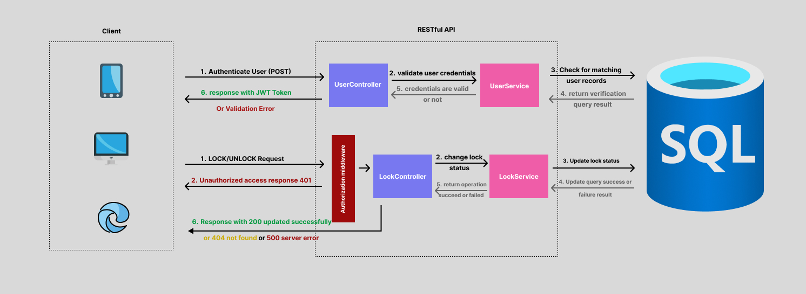

# Lock Control System Design Document 🔐
## 1. Introduction ✒️
### Context
In our office we have 2 main doors entrance and storage room currently employees are able to unlock these doors by using a **tag**. However sometimes we want to be able to unlock/lock a specific door remotely without requiring the physical presence of whoever have access to unlocking this specific door.
### Scope
Developing an interface that allows its users who have the right access to unlock/lock specific door remotely.

### Assumption
- Some locks should lock automatically after a specific period of time when unlocked.
- It should be easy to add new locks to our system without having to update the codebase correspondingly.

### Out of scope
Communication with the physical locks themselves is going to be out of our scope we will create a record for each lock in the database that will represent a lock status and information and be updated upon locking and unlocking.
## 2. Requirements 📃
### Functional Requirements
1. **Access Control** The system provide an interface for users to update the status of our locks.
2. **User Authentication** The interface should ensure that only authorized users can control specific locks and prevent any unauthorized attempts.
3. **Event History** Specific users (Admins) should be able to read the history of access events (i.e. see who made a specific events and when was this event performed).

### Non-Functional Requirements
1. **Scalability** The system should be able to scale horizontally to handle events for more than 1,000,000 locks simultaneously.
2. **Security** Preventing any unauthorized access to both our actions and users information and securing the communication between clients and our servers.
3. **Consistency** Reading invalid information for a lock might have terrible results so information should be always consistent across different data storages and servers.
4. **Maintainability** Other developers should be able to add new locks, users with new behaviors or onboarding new features easily into this implementation.

## 3. Solution Design 🚧
### High Level Design
Our system is going to consist of a **RESTful API** as it's 
1. **Stateless** which is going to make it easy to horizontally scale our application layer by running it on multiple machines.
2. **Decoupled** separating it from our UI layer will ensure that our system can accept requests from different clients on different platforms while also providing an easy way to add new components to our system.
3. **Simple** keeping it simple for developers to maintain and extend our software while in addition to the ease of communication via http requests which makes it easy to integrate with others.

The user will be able to communicate with our API via HTTP requests then the API will be responsible for processing the user request and updating the specified lock status which is stored in a **SQL** database **the reasons why we're going to use a relational database** are
1. **Relationships between entities** our system have a lot of relationship between its entities and there is a many-to-many relationship between locks, user Roles which is where relational databases shine the most as they have an a performance advantage when it comes to doing complex join queries.
2. **ACID** relational databases support ACID which helps achieve our consistency and data integrity requirements by using [database transactions](https://en.wikipedia.org/wiki/Database_transaction#:~:text=In%20a%20database%20management%20system,is%20known%20as%20a%20transaction.). 
3. **Ease of use** it also a good choice when it comes to maintainability as it's easy to use it specially when working with **.NET** thanks to Entity Framework which simplifies the interactions between our application and our database.
4. **Scalability** they can be either scaled vertically by increasing capacity or horizontally by adding more database servers.

After our user request is proceeded our API will return a response with a status code (200 success, 401 unauthorized access, 500 server error) to the client in JSON format.
*All I/O will be in JSON format due to its flexibility and wide adaptation making our software easily accessible on different types of clients (mobile, browser, desktop).*

In addition our API will be responsible to authenticating user by checking for **JWT token** in the HTTP request headers we use JWT tokens as they go well along with RESTful API's due to the fact that they're stateless as well in addition to not having issues while scaling up our system as they work well in a distributed environment. 

### Other Design Decisions
#### - How are we going to control different access levels?
say we have door A that all employees will have access to and door B that only limited amount of employees will have access to how will we go about this
*Solution A:* Giving each user a Role so people with Role = Employee can access only entrance but Role = Manager will have access to both entrance and storage. This solution is so simple and make it easy to group users by roles however it'll be rather difficult if say an employee is working temporary on different office so we need to change his role and if he comes back we will have to update it once again.
*Solution B:* Managing user access separately so we specify that User A have access to Lock A & B this will offer high flexibility but will also result in a complicated pivot table between users and locks and in case we want to update something we will have to update the value for each employee record. 

We're going to go with a mix between these two solutions where we will have Roles but we will deal with them like Security Groups so users will have more than one Role (Many to Many relationship) and each Role have information on what kind of locks it can access if we want to give an employee access to a new lock we are going to assign him an additional Role this way we can enjoy the categorization from solution A with the flexibility from Solution B.

#### - How will the autolocking functionality Work?
Once the user locks a door we could set a timeout that after x seconds the door should update its status to locked however if we just do this will put additional load on the server while keeping multiple threads occupied after a job is finished so we need to **decouple** this functionality from our API layer.
**Solution:** We're going to implement a basic [Azure Function](https://learn.microsoft.com/en-us/azure/azure-functions/functions-overview) it will run a scheduled task responsible for looking into the database and checking which locks that are unlocked should be locked right now and will update their values immediately. This will keep our system decoupled without affecting the performance, availability or scalability of our system.
 

### Low Level Design
#### ERD

#### RESTful API endpoints
| Endpoint | Verb | Description |
| -------- | --------  | -------- |
| /api/history | Get | fetches a list of events |
| /api/auth/login | POST | authenticates user and responds with an access token |
| /api/locks/lock/:LockId | POST | Update the lock with the given lock ID to be Locked |
| /api/locks/unlock/:LockId | POST | Update the lock with the given lock ID to be unlocked |

### Alternative Solutions 
**Event Driven Architecture** this will keep our system loosely coupled and scalable and usually event driven architecture works great with systems the require real time updates. However it'll add more complexity to the codebase while also introducing new potential problems related to the asynchronous nature of EDA.

**Document Database** a more flexible type of database and have an outstanding performance when trying to read or write into a document and easy to scale horizontally but struggles with queries the consists of joining multiple table which is something common in our system and also lacks ACID that relational database have.

## 4. Scaling Up ↗️
> [!NOTE]
> This is section discuss how we will be able to scale this codebase to serve on a higher scale. what is mentioned here is not part of the implementation

Thanks to our loosely coupled architecture and flexible design choices it's easy to scale up this system to be able to serve millions of requests each hour.

**- Horizontal Scaling** Having our RESTful API working on multiple machines would not be an issue thanks to the stateless nature of RESTful API's.

**- Load Balancing** Introducing a load balancer that distributes given requests on our workers servers the contains our application logic.

**- Queue** Having our workers subscribed to a message queue which help control system throughput and make sure any request is served even when all the servers are busy.

**- Database** We can easily scale our database into multiple database servers and use industry knowing techniques like sharding to ensure consistency within our system (each event or lock information is also stored into the same machine).

**- Redundancy** This will help us when having a scenario where a server is down we can redirect our reads and writes to another passive machine ready to serve as the down active machine.

**- Rate Limiting** Prevents potential attacks keeping the system secure and highly available.
## 5. Summary 💼
To allow users to remotely control access to different doors we are going to create a RESTful API. Users are going to be able to communicate with our interface via HTTP requests. The system will make sure that the users is authenticated and authorized to access this information by looking into the JWT token provided in the request's header information and then update a lock status based on the requested action from the user. Users should be able to see